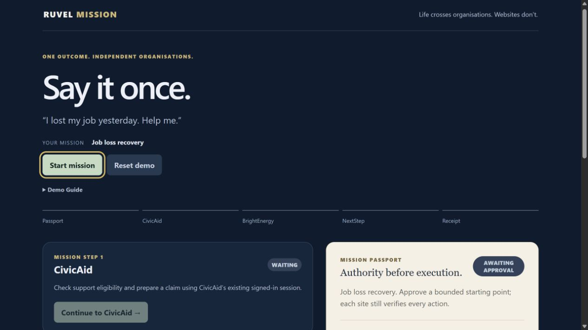
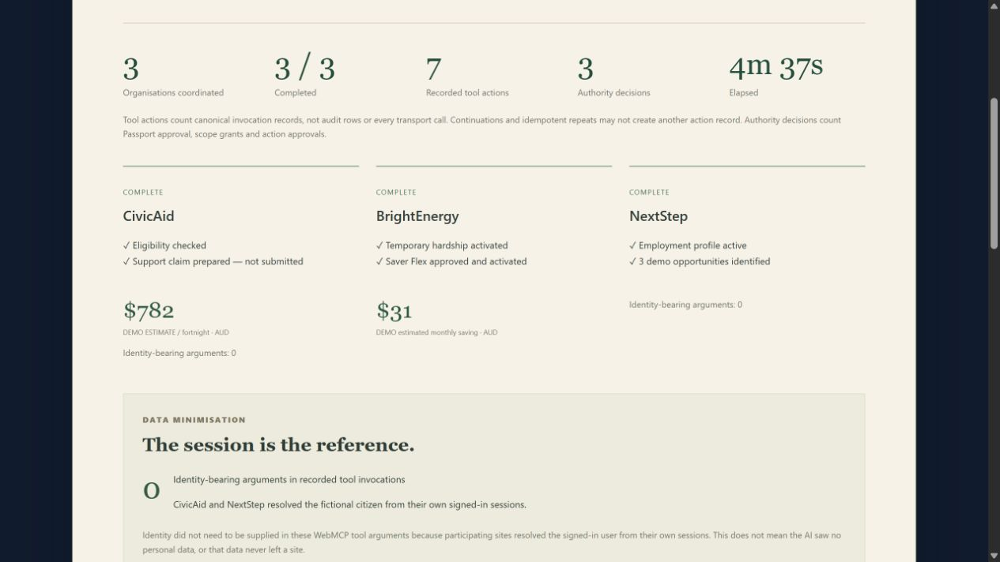
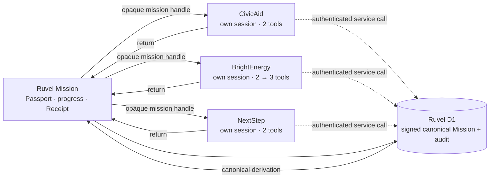

# Ruvel Mission

## Say it once.

**Life crosses organisations. Websites don't.**

Ruvel Mission lets a person delegate one outcome across independent WebMCP-enabled websites while each site retains control of its own session, data, policy and capabilities.

**Humans delegate outcomes.**<br>
**Sites retain authority.**<br>
**Agents coordinate capabilities.**

Ruvel is a deployed, fictional hackathon demonstration. Start from **[Ruvel Mission](https://ruvel-phase1-mission-dhili.jmsd0811.chatgpt.site)**, not a partner root.

| Public site | Role |
| --- | --- |
| [Ruvel Mission](https://ruvel-phase1-mission-dhili.jmsd0811.chatgpt.site) | Mission Passport, progress, durable audit and Mission Receipt |
| [CivicAid](https://ruvel-civicaid-dhili.jmsd0811.chatgpt.site) | Support eligibility and claim preparation |
| [BrightEnergy](https://ruvel-phase1-brightenergy-dhili.jmsd0811.chatgpt.site) | Account protection, dynamic authority and human approval |
| [NextStep](https://ruvel-nextstep-dhili.jmsd0811.chatgpt.site) | Employment profile and fictional role matching |

All people, accounts, identifiers, claims, amounts, employment details and opportunities are fictional demo data. Do not enter real personal information.



## What it is

One human intent—“I lost my job yesterday. Help me.”—becomes one Mission carried across three independent organisations. The agent uses each active site's native WebMCP tools. Ruvel coordinates progress without taking ownership of partner sessions, data or policy.

The product has two accountability bookends:

- **Mission Passport:** bounded authority before execution.
- **Mission Receipt:** canonical evidence after execution.

## The problem

A life event rarely fits one organisation. A person who loses work may need benefits support, energy hardship protection and employment help. Today, the person becomes the integration layer: repeating context, finding workflows, and carrying state from one website to the next.

Ruvel demonstrates a different pattern. The outcome travels; organisational authority does not.

## Demo scenario

The accepted path is:

1. Ruvel creates an opaque Mission and the human approves its initial Passport.
2. CivicAid checks fictional support eligibility and prepares—but does not submit—a claim.
3. BrightEnergy reads the fictional account and activates temporary hardship support.
4. A human grants plan-changing authority for this Mission only; BrightEnergy's actual tool surface changes from two tools to three.
5. The agent requests Saver Flex, an independent human approves, and a later continuation completes idempotently.
6. NextStep activates a fictional employment profile and returns three demo opportunities.
7. Ruvel completes the Mission and derives its Receipt from durable canonical state and audit.

## Why WebMCP is essential

WebMCP lets the active website expose a small, typed capability surface that is owned by that site. The agent does not scrape buttons or receive one universal cross-site API. CivicAid, BrightEnergy and NextStep independently register, describe and enforce their tools at their own top-level HTTPS origins.

That distinction enables the signature behavior:

> **Permission isn't a prompt. It's whether the capability exists.**

Before grant, BrightEnergy does not register `change_plan`, and a direct request is denied server-side. After the human grants mission-only scope, the actual native registration changes live from **2 → 3** without navigation. Canonical policy remains authoritative even if a browser were stale.

## Mission Passport

The Passport expresses bounded mission authority. Initial approved capabilities are:

- CivicAid: `check_eligibility`, `prepare_support_claim`
- BrightEnergy: `get_account_summary`, `apply_hardship`
- NextStep: `register_profile`, `match_roles`

It is HMAC-signed server-side, stored inside Ruvel's canonical D1 record and independently verified by each partner server. It is not a browser token and is never transported as a URL snapshot. BrightEnergy's later `change_plan` grant advances the Passport version for that Mission only.

## BrightEnergy: dynamic authority and human approval

BrightEnergy begins with exactly two native WebMCP tools. `change_plan` appears only after a separate human grant. Calling it with `{plan: "saver_flex"}` returns `awaiting_approval` quickly and leaves the current plan unchanged.

The human then sees the consequential choice—including the fictional $31/month estimated saving—and approves independently. A later `change_plan({approvalId})` completes the action. Repeating the continuation is idempotent.

This separates three concepts that are often blurred together:

1. mission scope,
2. tool availability,
3. approval of a consequential action.

## CivicAid: the session is the reference

CivicAid exposes `check_eligibility({})` and `prepare_support_claim({})`. Its own signed-in fictional session resolves the citizen, so the agent supplies no name, date of birth, address or identifier argument.

> **The session is the reference.**

The accepted demo produces a fictional $782/fortnight estimate and prepares five claim fields while leaving one declaration for a human. It never submits a claim. “Zero identity-bearing arguments” is a qualified tool-input metric; it does not claim the AI saw no site data or that data never crossed a boundary.

## NextStep

NextStep exposes exactly `register_profile({})` and read-only `match_roles({limit: 3})`. It resolves fictional employment context from its own signed session and returns fixed, clearly labelled demo opportunities. No job application is submitted and no external job API is called.

The implementation deliberately adds no extra approval or product feature. It proves that the same durable Mission pattern extends to another independent site without changing the architecture.

## Mission Receipt

Ruvel completes a Mission only when all three canonical partner outcomes exist. The server then derives a retainable Receipt from the signed D1 state and de-duplicated audit; the browser cannot supply its metrics.

The validated golden path shows:

- **3** organisations coordinated
- **3 / 3** complete
- **7** recorded tool actions
- **3** authority decisions
- **0** identity-bearing arguments in recorded tool invocations
- **20** canonical audit events

The Receipt includes actual organisation outcomes, elapsed time, BrightEnergy's authority history and a human-readable timeline. Technical audit is secondary and allowlisted. The bearer handle is masked; approval identifiers, session values and raw citizen details are omitted.



## Proven architecture



Ruvel and all three partners are separate top-level HTTPS sites. Navigation carries only `?mission=m_<random handle>`. No Passport, mission state, audit, approval or identity snapshot is placed in a fragment or query parameter.

Each partner resolves a purpose-separated Secure, HttpOnly fictional session, authenticates a server-to-server request to Ruvel, verifies the current Passport and commits with compare-and-swap revision protection. Ruvel stores one compact signed Mission record in a Sites-managed D1 binding.

See [the architecture document](docs/architecture.md) and [architecture decisions](docs/decisions.md) for the full trust boundaries and evidence.

## What Phase 0 taught us

The original concept attempted to expose partner WebMCP tools through a cross-origin iframe. The tested runtime provided `document.modelContext` at the top-level document but not inside that cross-origin frame, even with the expected permissions configuration. Top-level registration, invocation and live registration replacement worked.

That evidence produced the final multi-page architecture instead of a workaround: the agent follows the Mission to each independent top-level site. The same spike also observed a tool-transport timeout, which is why BrightEnergy returns `awaiting_approval` and resumes after an independent human decision rather than holding one call open.

The retained evidence is in [docs/webmcp-spike.md](docs/webmcp-spike.md).

## Judge quickstart

Use the concise [judge walkthrough](docs/judge-script.md).

1. Open [Ruvel Mission](https://ruvel-phase1-mission-dhili.jmsd0811.chatgpt.site).
2. Reset Demo if needed, start a fresh Mission and approve the Passport.
3. Complete CivicAid with its two `{}` tools.
4. At BrightEnergy, show two tools, grant mission-only plan authority, show the live third tool, then complete the independent approval flow.
5. Complete NextStep with profile registration and three role matches.
6. Return to Ruvel, complete the Mission and open the Receipt.

The browser must support the experimental WebMCP runtime used by Codex Site Tools. The websites still render elsewhere, but native tool discovery is only claimed for the tested Codex browser environment.

## Local development

Requirements: Node.js 22+ and pnpm 11.

```bash
pnpm install
pnpm dev
```

Copy `.env.example` only when configuring a compatible server runtime. Keep real signing and service credentials in server-side hosting secret bindings; never place them in `.env`, client JavaScript or `VITE_*` variables. Local Vite previews render the interfaces but do not emulate the production D1/API runtime.

## Tests and validation

**WebMCP validation:** GoogleChromeLabs `webmcp-evals` independently reproduced the deployed tool surfaces and BrightEnergy's 2 → 3 authority transition. Gemini-backed natural-language evaluation passed 10/10 cases with exact required tool selections and arguments.

**Authority-bound capability lifecycle:** BrightEnergy begins with 2 WebMCP tools. Granting mission-only plan authority dynamically registers `change_plan`, producing a native `toolchange` event and a 2 → 3 registry transition without reload. Terminating the Mission Passport unregisters the Mission capability surface (3 → 0); establishing a fresh Passport restores the baseline 0 → 2 surface. The complete lifecycle was reproduced twice.

```bash
pnpm lint
pnpm typecheck
pnpm test
pnpm build
pnpm test:e2e
```

The frozen release passed:

- **51 / 51** unit and integration tests
- **12 / 12** committed deployed E2E cases
- **3 / 3** consecutive final Receipt paths, one worker and zero retries
- one complete native WebMCP journey across all three partners
- fresh-context durability, full reset and 20-event audit checks
- four-origin console and credential-exposure validation

The deployed Playwright suite uses a WebMCP contract harness and is not presented as native evidence. The separate Codex browser journey is the native proof. Exact timings and bounded limitations are in the [Phase 4 report](docs/phase4-report.md).

## Browser and runtime requirements

- Public pages require normal trusted HTTPS; TLS verification and browser security must remain enabled.
- Native WebMCP has been validated in the tested Codex browser runtime, not every browser.
- Stock Edge may report the documented experimental `tools` Permissions-Policy limitation and a hosting-injected inline-script CSP violation. The application does not weaken CSP to silence either message.
- Public-network and browser-control latency varies; approval requests return pending rather than waiting for a human inside one tool call.

## Security and demo boundaries

- The opaque Mission handle is an unguessable bearer reference, not production authentication.
- Every identity, account, claim, amount and opportunity is fictional.
- Partner cookies are purpose-separated fictional demo sessions.
- Passports expire after one hour; the demo resets and reapproves rather than silently extending authority.
- Trusted demo servers share rotated signing/service credentials stored only as hosting secrets. Production key isolation and partner-specific service authorization are future work.
- No external government, energy, employment or identity API is called.
- The Receipt's privacy metric describes recorded WebMCP arguments, not everything an AI or website could observe.

This is a bounded hackathon demonstration, not a production service or security certification.

## Repository layout

```text
apps/mission          Ruvel hub, D1 worker and Mission Receipt
apps/civicaid         Benefits-support partner
apps/brightenergy     Dynamic-authority and approval partner
apps/nextstep         Employment-support partner
packages/mission-core Shared state, policy, server and receipt logic
e2e                   Deployed golden paths and regressions
docs                  Architecture, evidence, reports and submission assets
scripts               Build and public-safety validation utilities
```

## Licence

Ruvel Mission is released under the [MIT Licence](LICENSE).
